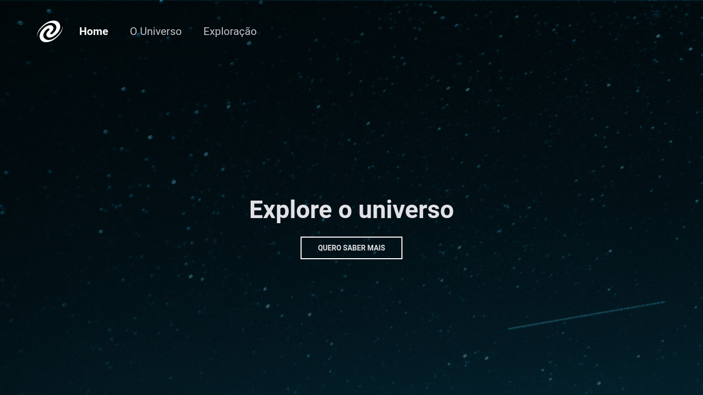

# SPA Universe
 
 O desafio era pra criar uma página utiliando os conceitos de SPA (Single Page Application) Aplicação de
 página única.
 Aplicação que ao invés de carregar toda a página ou redirecionar o usuário para uma nova página, apenas o conteúdo da principal é atualizado de forma assíncrona. 
 Matendo a estrutura da página estática.

[](https://www.linkedin.com/in/jonas-martins-950a30184/)

 <p align="center">
  <a href="#-tecnologias">Tecnologias</a>&nbsp;&nbsp;&nbsp;|&nbsp;&nbsp;&nbsp;
  <a href="#-projeto">Projeto</a>&nbsp;&nbsp;&nbsp;|&nbsp;&nbsp;&nbsp;
  <a href="#-projeto">Iniciar Projeto</a>
  
</p>


## 🚀 Tecnologias

Esse projeto foi desenvolvido com as seguintes tecnologias:

- HTML
- CSS
- JavaScript


## 💻 Projeto




Aprendizado durante o projeto:

- Conceitos de SPA;
- Mapeamento de rotas;
- Assíncrono e promises;
- Orientação a objetos;
- Classes e muito mais.

## 🚀 Iniciar Projeto

Clonar Projeto e acesar pasta e iniciar o servidor é necessário ter nodeJs instalado e o Visual Studio Code.

### Programas necessários para iniciar projeto
- [NodeJS](https://nodejs.org/en/)
- [Live Server (Opcional)](https://marketplace.visualstudio.com/items?itemName=ritwickdey.LiveServer)
- [Visual Studio Code - Vscode](https://code.visualstudio.com/)

Clone o projeto e acesso a pasta.

```bash
$ git clone https://github.com/felipe-gomes-vicente/spa-universe.git
$ cd spa-universe
```
Com o nodeJs instalado iniciar servidor

```bash
 $ yarn
 $ yarn start
 ```


 ## 📝 Licença

Esse projeto está sob a licença MIT. Veja o arquivo [LICENSE](LICENSE.md) para mais detalhes.

&nbsp;

<p align="center">Feito com 💜 by Jonas Martins👋</p>


